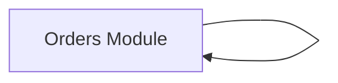

# 14 图示

> 生成时间:2026-05-29T09:00:02.642Z  ·  基于 commit:ae504e0162639edd5f826687ea893f6a7f991e64  ·  事实源:specs/repos/*/knowledge-graph.json + specs/arch-layer.json

## 上下文图

```mermaid
flowchart LR
  component_orders["Orders Module"]
  component_orders --> component_orders
```
