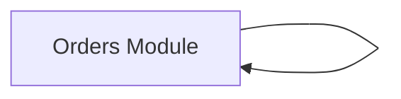

# Diagrams

> 生成时间:2026-05-28T15:22:09.394Z  ·  基于 commit:6ea05653a7f15c99c9d3f55cf696d8c9a61b770e  ·  事实源:specs/repos/*/knowledge-graph.json + specs/arch-layer.json

## 上下文图

[evidence: sample::module:orders, sample::function:src/orders.ts:createOrder]
