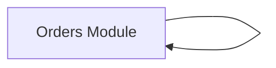

# 14 图示

> 生成时间:2026-05-29T08:24:56.174Z  ·  基于 commit:dfce0cc851a716f2b8b41d9efe076a7dcb4f1efe  ·  事实源:specs/repos/*/knowledge-graph.json + specs/arch-layer.json

## 上下文图

```mermaid
flowchart LR
  component_orders["Orders Module"]
  component_orders --> component_orders
```
