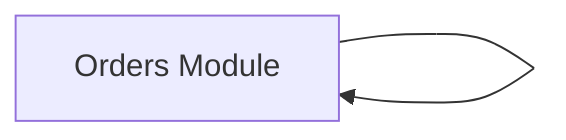

# 14 图示

> 生成时间:2026-05-29T08:29:46.939Z  ·  基于 commit:a90f505bfff99e4985db4de6f6a409cbada60dd3  ·  事实源:specs/repos/*/knowledge-graph.json + specs/arch-layer.json

## 上下文图

```mermaid
flowchart LR
  component_orders["Orders Module"]
  component_orders --> component_orders
```
