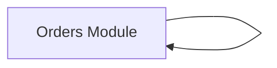

# 14 图示

> 生成时间:2026-05-29T07:52:01.589Z  ·  基于 commit:508a0c26f5f805556bac513a5caeb51bf851491a  ·  事实源:specs/repos/*/knowledge-graph.json + specs/arch-layer.json

## 上下文图

## 证据来源

| 判断 | 代码位置 |
| --- | --- |
| 图示组件: Orders Module | sample::module:orders sample::function:src/orders.ts:createOrder |
| 图示链路: Create Order | sample::file:src/app.ts sample::module:orders sample::function:src/orders.ts:createOrder |
