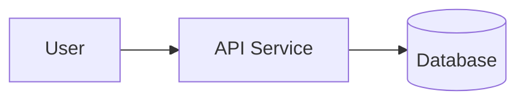

# C4 Extraction Rules

> Model depth turns deterministic repository facts into current-state C4 views. Diagrams must be grounded in manifest and dependency evidence.

## C4 Levels in v1.0

| Level | Required? | Output |
|---|---|---|
| Context | yes for onboard/model | `diagrams/c4-context.mmd` |
| Container | yes for onboard/model | `diagrams/c4-container.mmd` |
| Component | only for key services | `diagrams/c4-component-{service}.mmd` |

## Source Inputs

Allowed sources:

- `evidence/仓库与组件清单.yaml`
- `evidence/依赖与链路图谱.yaml`
- deterministic model worker output
- user-provided architecture docs with evidence refs

Disallowed source:

- free-form memory of earlier conversation without evidence.

## Context Diagram

Include:

- The system boundary.
- External systems from `external_dependencies`.
- Primary users/actors only when present in PRD or docs.
- High-level data/control flows.

Do not include every module.

## Container Diagram

Include:

- Deployable services.
- Databases and queues.
- Frontends/BFFs.
- External dependencies that affect runtime.
- Major synchronous/asynchronous edges.

Use dependency `type` to label edges: HTTP, RPC, event, database, cache, config.

## Component Diagram

Generate component diagrams only for:

- services in critical flows;
- high-risk/high-churn services;
- user-selected deep-dive repos.

Keep each component diagram to 5-15 nodes. If larger, split by bounded context or module group.

## Mermaid Conventions

Use Mermaid `flowchart LR` by default:



Stable IDs:

- lowercase kebab names converted to safe Mermaid IDs;
- no spaces in node IDs;
- labels may contain readable names.

## Evidence Header

Each `.mmd` file starts with comments:

```text
%% generated_by: arch-analyze
%% source: evidence/依赖与链路图谱.yaml
%% baseline_commits: payments-service=1a2b3c4
```

## Quality Rules

- No orphan node unless it is explicitly external or user-facing.
- No edge without an evidence-backed dependency.
- Use different shapes for external systems, queues, and databases.
- Avoid overloading one diagram; create component diagrams for detail.
- If fireworks rendering is unavailable, Mermaid is the canonical fallback.

## Validation

Before accepting model depth:

- Mermaid parses in a renderer or at least passes syntax sanity.
- Nodes referenced by edges exist.
- Diagram sources cite evidence YAML.
- Current-state diagrams do not include future target design.
