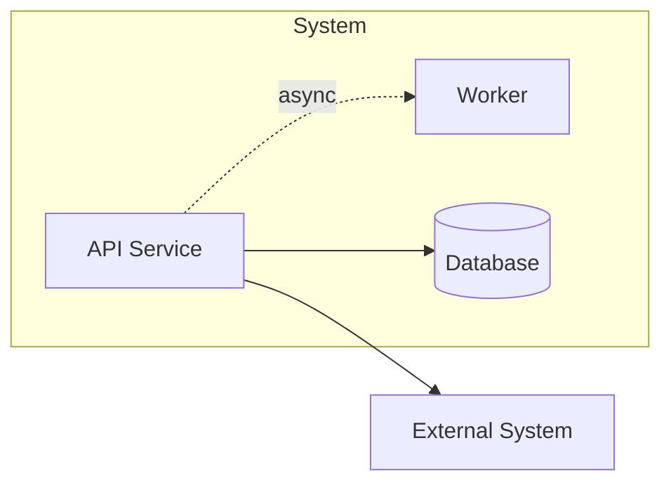
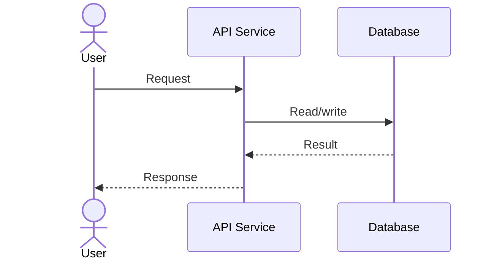
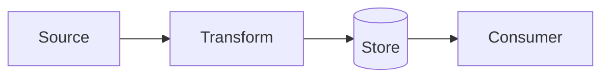

# Mermaid Templates

> Mermaid is the canonical diffable diagram source. Generate it even when fireworks succeeds.

## Frontmatter Plus Mermaid

Every `.mmd` file starts with YAML frontmatter, followed by Mermaid.

```text
---
backend: mermaid
source: evidence/依赖与链路图谱.yaml
generated_at: 2026-05-24T12:00:00Z
degraded: false
degraded_reason: null
style: blueprint
diagram_type: c4-container
---

flowchart LR
  ...
```

## Flowchart Template



## Sequence Template



## Data Flow Template



## ID Rules

- Use ASCII-safe IDs.
- Labels can be human-readable.
- Avoid punctuation in IDs.
- Ensure every edge endpoint is declared.

## Validation Checklist

- Mermaid block has exactly one diagram type.
- No orphan internal nodes unless source says isolated.
- Edge directions match dependency map.
- Sensitive or external boundaries are labeled only from source evidence.
