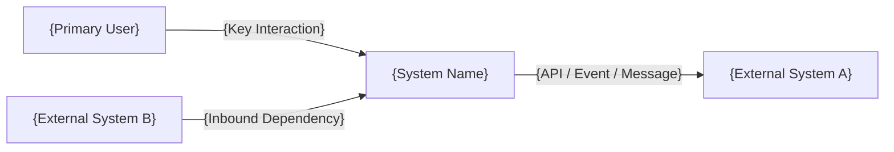
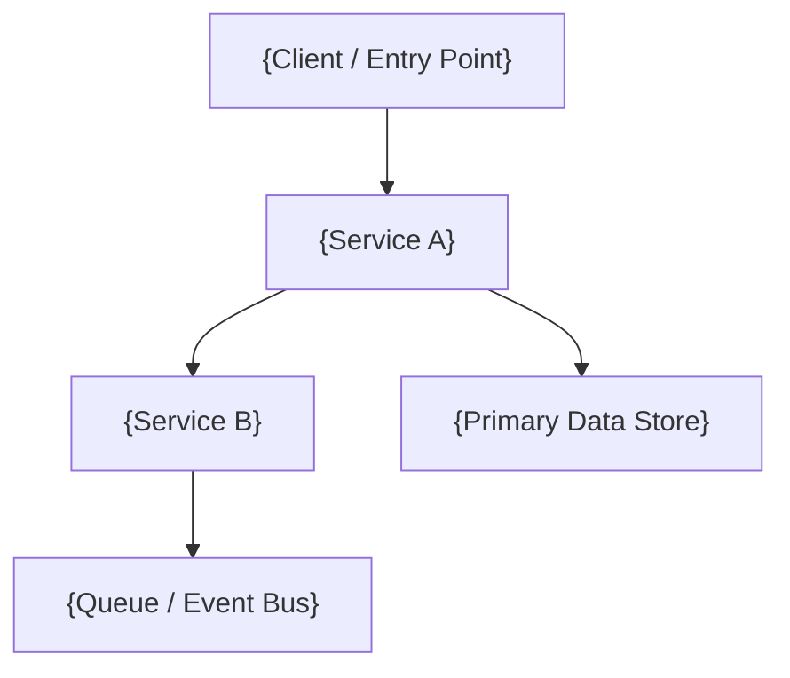
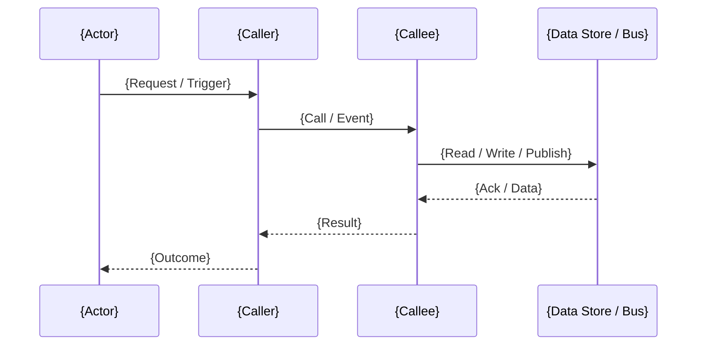
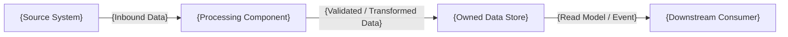
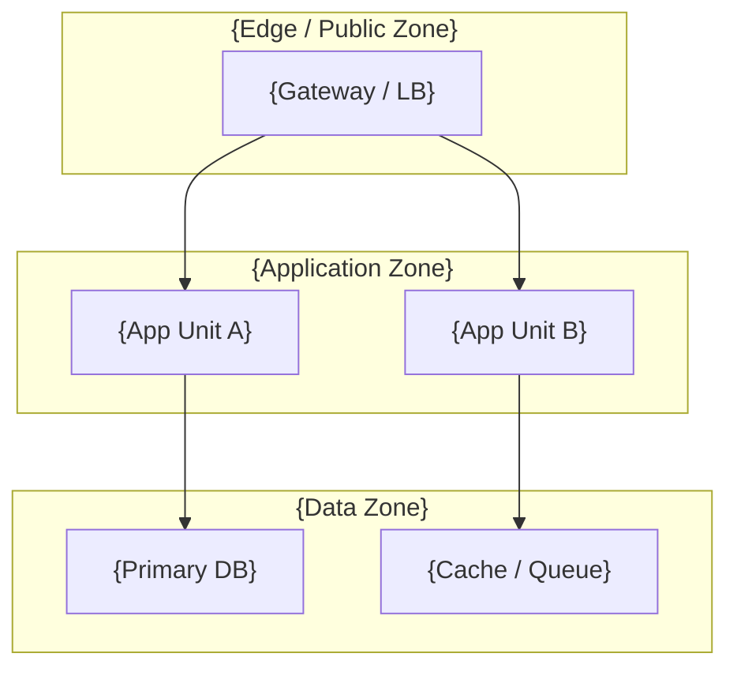

# Mermaid Templates

> 用途：先用这些最小骨架出图，再根据 `specs` 或 CR 事实填充节点和连线。

## 1. Context

## 2. Container

## 3. Sequence

## 4. Data Flow

## 5. Deployment

## 使用规则

- 节点名称必须与 `specs` / CR 中的命名一致。
- 每张图只表达一种主视角，不要把 context 和 deployment 混在一起。
- 如果 source 不足，宁可删掉节点并标注 `known unknowns`，不要脑补。
